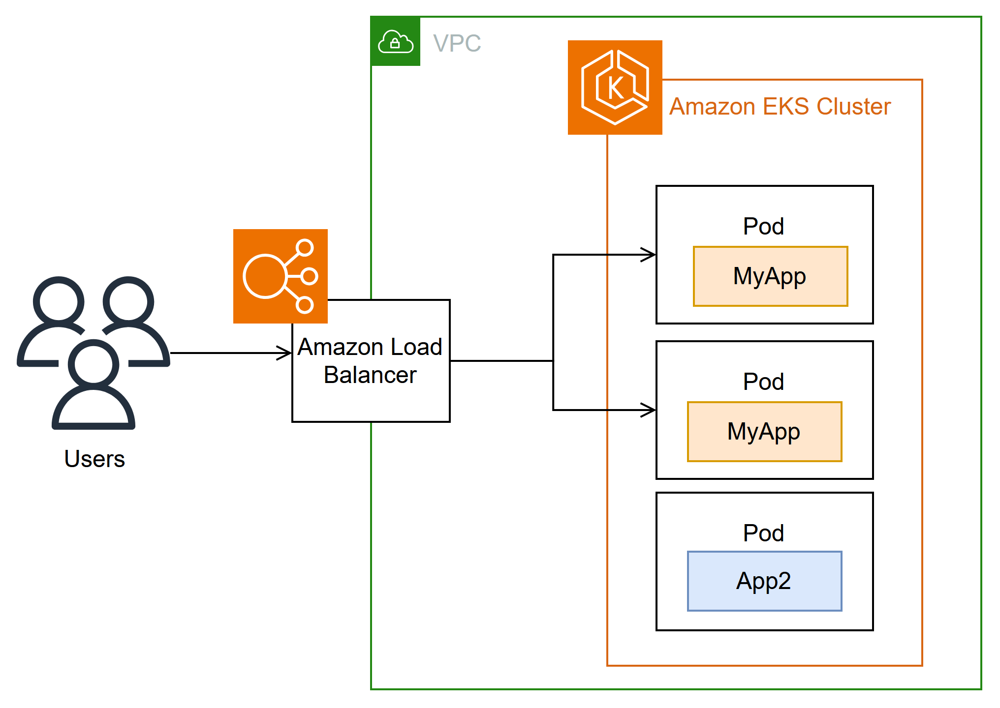

# AWS Load Balancer Controller add-on for EKS
A Terraform module to deploy AWS Load Balancer Controller on EKS clusters. The controller watches for Kubernetes Ingress or Service resources. In response, it creates the appropriate AWS Elastic Load Balancing resources.


*More Information*: https://docs.aws.amazon.com/eks/latest/userguide/aws-load-balancer-controller.html

---
## Inputs

| Name                       | Description                                      | Type   | Default  | Required |
|---------------------------|--------------------------------------------------|---------|----------|-----------|
| `cluster_name`            | The EKS cluster name                             | string | n/a      | ✅ Yes   |
| `region`                  | AWS region where the EKS cluster is deployed     | string | n/a      | ✅ Yes   |
| `aws_lb_controller_version` | AWS Load Balancer Controller version           | string | `2.13.0` | ❌ No    |


## Example Usage

```hcl
module "aws_lb_controller" {
  source                    = "github.com/wedaa-tech/terraform-aws-eks-lb-controller"
  cluster_name              = "<% eks_cluster_name %>"
  region                    = "<% eks_cluster_deployed_region %>"
  aws_lb_controller_version = "2.13.0" # Optional: override if needed
}
```

---
## Providers

| Name         | Purpose                                              | Source              | Version    |
|---------------|------------------------------------------------------|---------------------|-------------|
| `aws`       | Manage IAM resources and EKS cluster data.          | `hashicorp/aws`     | `~> 5`   |
| `kubernetes` | Manage Kubernetes resources (e.g., service account). | `hashicorp/kubernetes` | `~> 2.20` |
| `helm`     | Deploy Helm charts (AWS LB controller).            | `hashicorp/helm`    | `~> 2.6` |
| `http`     | Download IAM policy JSON file dynamically.          | `hashicorp/http`    | `3.5.0` |

## Semantic Pull Requests

Pull Requests or Commits must follow conventional specs below:

- `ci:` Changes to our CI configuration files and scripts (example scopes: GitHub Actions)
- `docs:` Documentation only changes
- `feat:` A new feature
- `fix:` A bug fix
- `refactor:` A code change that neither fixes a bug nor adds a feature
- `style:` Changes that do not affect the meaning of the code (white-space, formatting, missing semi-colons, etc)
- `test:` Adding missing tests or correcting existing tests

## License

[](https://opensource.org/licenses/Apache-2.0)

See [LICENSE](LICENSE) for full details.

    Licensed to the Apache Software Foundation (ASF) under one
    or more contributor license agreements.  See the NOTICE file
    distributed with this work for additional information
    regarding copyright ownership.  The ASF licenses this file
    to you under the Apache License, Version 2.0 (the
    "License"); you may not use this file except in compliance
    with the License.  You may obtain a copy of the License at

      https://www.apache.org/licenses/LICENSE-2.0

    Unless required by applicable law or agreed to in writing,
    software distributed under the License is distributed on an
    "AS IS" BASIS, WITHOUT WARRANTIES OR CONDITIONS OF ANY
    KIND, either express or implied.  See the License for the
    specific language governing permissions and limitations
    under the License.